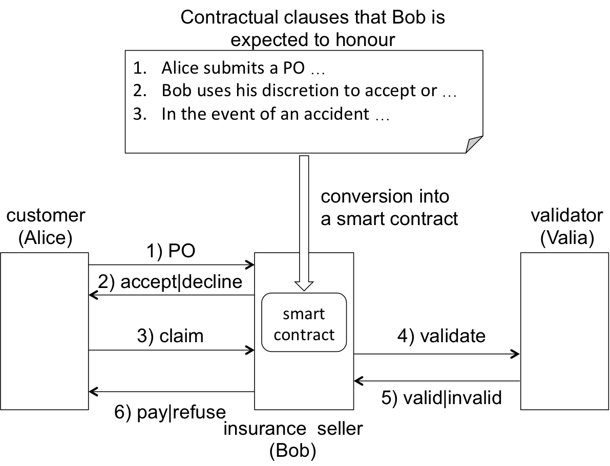

# SoliditySample
</br>
This repository hosts a Solidity 
implementation of a car insurance 
application based on a smart contract 
implemented in Solidity language --currently 
the standard language of the Etherereum 
blockchain.

The implementation is only an skeleton, as
opposed to a complete implementation, built
for evaluation purpuses. It is meant to 
complement the report *Smart Contracts Deployed
on Trusted Third Parties are not a Bad Idea*
that we will publish somewhere else.

 

# 1.- Car insurance scenario

```
1) Alice submits a Purchase Order (PO) request to Bob 
   to purchase her insurance.
     a. ThePOisadocumentthatincludesthepaymentto cover 
        insurance premium, car registration details, 
        Alice’s personal details and Alice’s preferences 
        regarding the storage of her personal details.
     b. Bob stores Alice’s personal details in accordance 
        with Alice’s preferences, she is entitled to choose 
        from two alternatives:
         * delete: Bob’s insurance company is expected 
           to delete Alice’s personal details within a day 
           after declining to sell the insurance or a day 
           after the expiration of the insurance certificate.
         * store: Alice grants permission to the insurance company 
           to store her details indefinitely unless they are 
           notified by Alice to delete them. In the latter case, 
           the insurance company is expected to delete Alice’s 
           details within 14 days after receiving Alice’s request.

2) Bob uses his discretion (for example, on the basis of 
   the registration number) to accept or decline Alices’s PO, 
   within 10 min of submission of the PO.
   a. if Bob accepts, he proceeds to collect Alice’s payment 
   and declare the insurance policy in force.

3) In the event of an accident, Alice submits an insurance 
   claim to Bob.

4) Bob consults with his validator (Valia) the legality of 
   the claim (see validation operation).

5) Valia declares either valid or invalid

6) On the basis of Valia’s verdict, Bob proceeds to either 
   pay or refuse the claim within 24 hours of the submission 
   of the claim.

```

A graphical view of the architecture of the
car insurance application is shown in the
figure below.

<p align="center">
  
</p>


# 2. Contributors

*  Linmao Song, he is an independent research the
   main contact and reachable
   at Linmao.Song@gmail.com.
